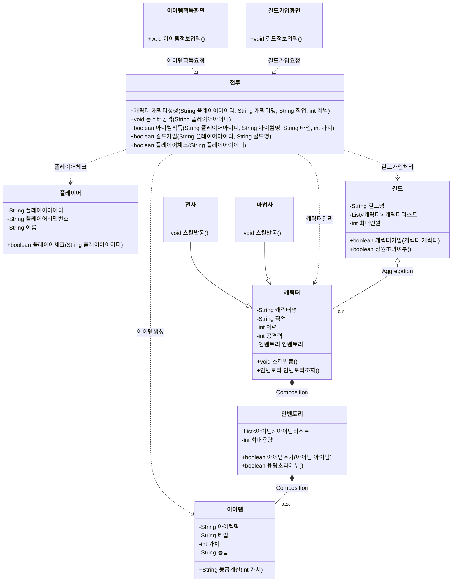

```mermaid
classDiagram

    class 플레이어 {
        -String 플레이어아이디
        -String 플레이어비밀번호
        -String 이름
        +boolean 플레이어체크(String 플레이어아이디)
    }

    class 캐릭터 {
        -String 캐릭터명
        -String 직업
        -int 체력
        -int 공격력
        -인벤토리 인벤토리
        +void 스킬발동()
        +인벤토리 인벤토리조회()
    }

    class 전사 {
        +void 스킬발동()
    }

    class 마법사 {
        +void 스킬발동()
    }

    class 전투 {
        +캐릭터 캐릭터생성(String 플레이어아이디, String 캐릭터명, String 직업, int 레벨)
        +void 몬스터공격(String 플레이어아이디)
        +boolean 아이템획득(String 플레이어아이디, String 아이템명, String 타입, int 가치)
        +boolean 길드가입(String 플레이어아이디, String 길드명)
        +boolean 플레이어체크(String 플레이어아이디)
    }

    class 아이템 {
        -String 아이템명
        -String 타입
        -int 가치
        -String 등급
        +String 등급계산(int 가치)
    }

    class 인벤토리 {
        -List~아이템~ 아이템리스트
        -int 최대용량
        +boolean 아이템추가(아이템 아이템)
        +boolean 용량초과여부()
    }

    class 길드 {
        -String 길드명
        -List~캐릭터~ 캐릭터리스트
        -int 최대인원
        +boolean 캐릭터가입(캐릭터 캐릭터)
        +boolean 정원초과여부()
    }

    class 아이템획득화면 {
        +void 아이템정보입력()
    }

    class 길드가입화면 {
        +void 길드정보입력()
    }

    전사 --|> 캐릭터
    마법사 --|> 캐릭터

    아이템획득화면 ..> 전투 : 아이템획득요청
    길드가입화면 ..> 전투 : 길드가입요청

    전투 ..> 플레이어 : 플레이어체크
    전투 ..> 캐릭터 : 캐릭터관리
    전투 ..> 아이템 : 아이템생성
    전투 ..> 길드 : 길드가입처리

    캐릭터 *-- 인벤토리 : Composition
    인벤토리 *-- "0..10" 아이템 : Composition
    길드 o-- "0..5" 캐릭터 : Aggregation
```