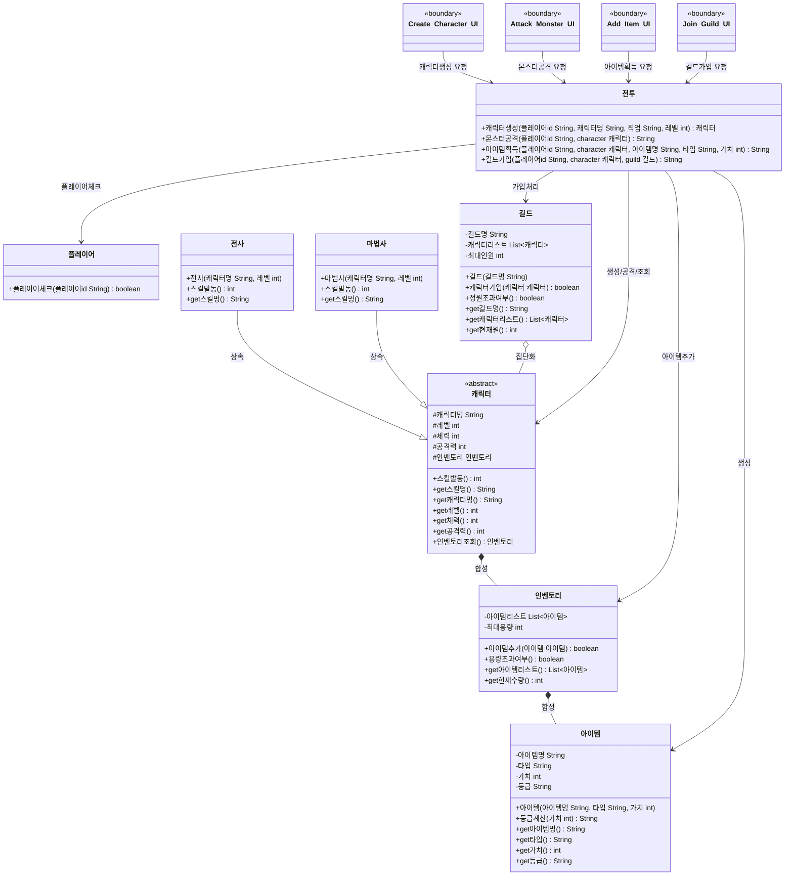

```mermaid
classDiagram

    class 플레이어 {
        +플레이어체크(플레이어id String) boolean
    }

    class 캐릭터 {
        <<abstract>>
        #캐릭터명 String
        #레벨 int
        #체력 int
        #공격력 int
        #인벤토리 인벤토리
        +스킬발동() int
        +get스킬명() String
        +get캐릭터명() String
        +get레벨() int
        +get체력() int
        +get공격력() int
        +인벤토리조회() 인벤토리
    }

    class 전사 {
        +전사(캐릭터명 String, 레벨 int)
        +스킬발동() int
        +get스킬명() String
    }

    class 마법사 {
        +마법사(캐릭터명 String, 레벨 int)
        +스킬발동() int
        +get스킬명() String
    }

    class 전투 {
        +캐릭터생성(플레이어id String, 캐릭터명 String, 직업 String, 레벨 int) 캐릭터
        +몬스터공격(플레이어id String, character 캐릭터) String
        +아이템획득(플레이어id String, character 캐릭터, 아이템명 String, 타입 String, 가치 int) String
        +길드가입(플레이어id String, character 캐릭터, guild 길드) String
    }

    class 인벤토리 {
        -아이템리스트 List~아이템~
        -최대용량 int
        +아이템추가(아이템 아이템) boolean
        +용량초과여부() boolean
        +get아이템리스트() List~아이템~
        +get현재수량() int
    }

    class 아이템 {
        -아이템명 String
        -타입 String
        -가치 int
        -등급 String
        +아이템(아이템명 String, 타입 String, 가치 int)
        +등급계산(가치 int) String
        +get아이템명() String
        +get타입() String
        +get가치() int
        +get등급() String
    }

    class 길드 {
        -길드명 String
        -캐릭터리스트 List~캐릭터~
        -최대인원 int
        +길드(길드명 String)
        +캐릭터가입(캐릭터 캐릭터) boolean
        +정원초과여부() boolean
        +get길드명() String
        +get캐릭터리스트() List~캐릭터~
        +get현재원() int
    }

    class Create_Character_UI {
        <<boundary>>
    }

    class Attack_Monster_UI {
        <<boundary>>
    }

    class Add_Item_UI {
        <<boundary>>
    }

    class Join_Guild_UI {
        <<boundary>>
    }

    전사 --|> 캐릭터 : 상속
    마법사 --|> 캐릭터 : 상속

    캐릭터 *-- 인벤토리 : 합성
    인벤토리 *-- 아이템 : 합성
    길드 o-- 캐릭터 : 집단화

    Create_Character_UI --> 전투 : 캐릭터생성 요청
    Attack_Monster_UI --> 전투 : 몬스터공격 요청
    Add_Item_UI --> 전투 : 아이템획득 요청
    Join_Guild_UI --> 전투 : 길드가입 요청

    전투 --> 플레이어 : 플레이어체크
    전투 --> 캐릭터 : 생성/공격/조회
    전투 --> 아이템 : 생성
    전투 --> 인벤토리 : 아이템추가
    전투 --> 길드 : 가입처리
```