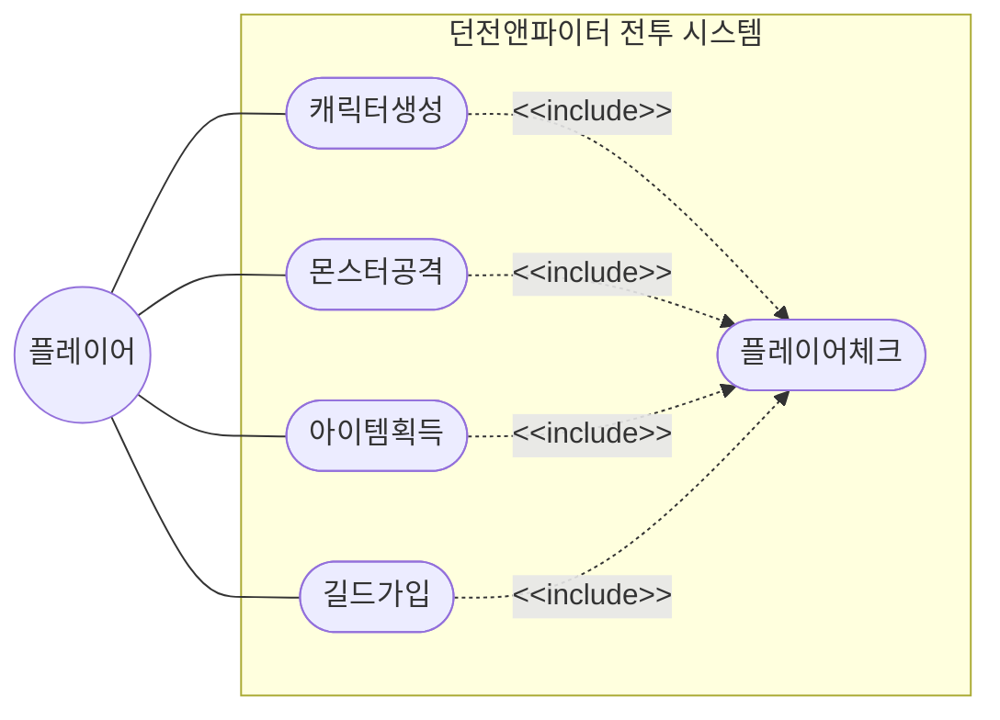

```mermaid
graph LR
    %% 액터
    Player((플레이어))

    %% 시스템 경계
    subgraph DnF_Battle2_System["던전앤파이터 전투 시스템"]
        UC1([캐릭터생성])
        UC2([몬스터공격])
        UC3([아이템획득])
        UC4([길드가입])
        UC5([플레이어체크])
    end

    %% 플레이어가 직접 수행하는 기능
    Player --- UC1
    Player --- UC2
    Player --- UC3
    Player --- UC4

    %% include 관계
    UC1 -. "&lt;&lt;include&gt;&gt;" .-> UC5
    UC2 -. "&lt;&lt;include&gt;&gt;" .-> UC5
    UC3 -. "&lt;&lt;include&gt;&gt;" .-> UC5
    UC4 -. "&lt;&lt;include&gt;&gt;" .-> UC5
```