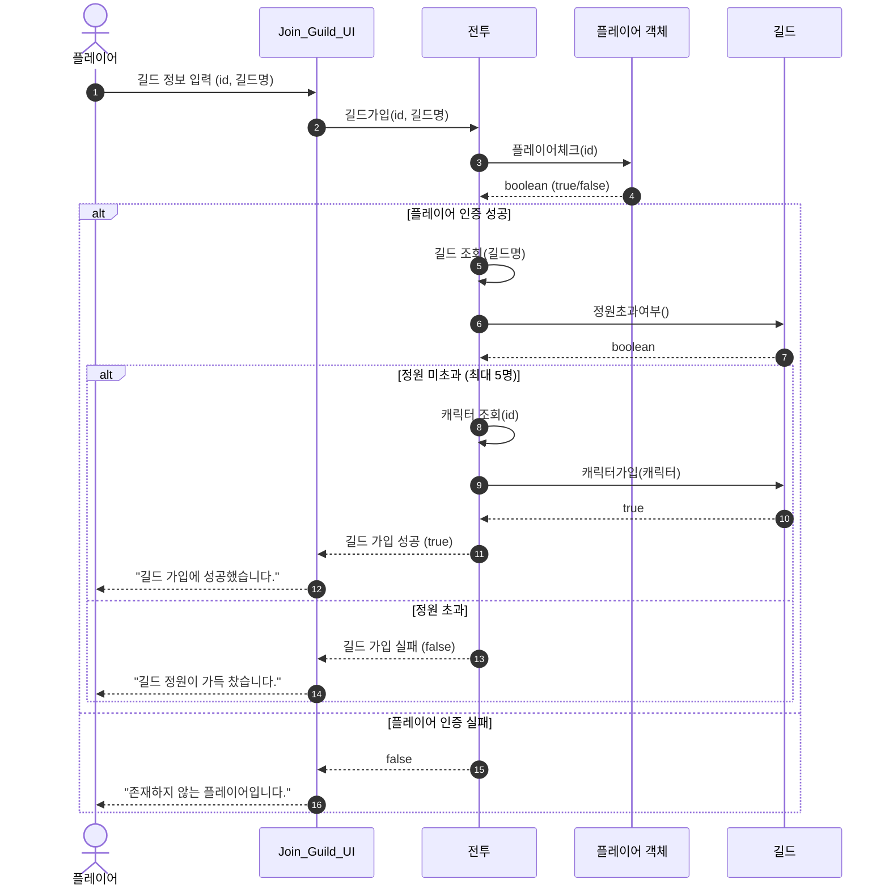

```mermaid
sequenceDiagram
    autonumber
    actor Player as 플레이어
    participant UI as Join_Guild_UI
    participant Battle as 전투
    participant Pl as 플레이어 객체
    participant Guild as 길드
    
    Player->>UI: 길드 정보 입력 (id, 길드명)
    UI->>Battle: 길드가입(id, 길드명)
    
    
        
        Battle->>Pl: 플레이어체크(id)
        Pl-->>Battle: boolean (true/false)
 
    
    alt 플레이어 인증 성공
        Battle->>Battle: 길드 조회(길드명)
        Battle->>Guild: 정원초과여부()
        Guild-->>Battle: boolean
        
        alt 정원 미초과 (최대 5명)
            Battle->>Battle: 캐릭터 조회(id)
            Battle->>Guild: 캐릭터가입(캐릭터)
            Guild-->>Battle: true
            Battle-->>UI: 길드 가입 성공 (true)
            UI-->>Player: "길드 가입에 성공했습니다."
        else 정원 초과
            Battle-->>UI: 길드 가입 실패 (false)
            UI-->>Player: "길드 정원이 가득 찼습니다."
        end
    else 플레이어 인증 실패
        Battle-->>UI: false
        UI-->>Player: "존재하지 않는 플레이어입니다."
    end
```