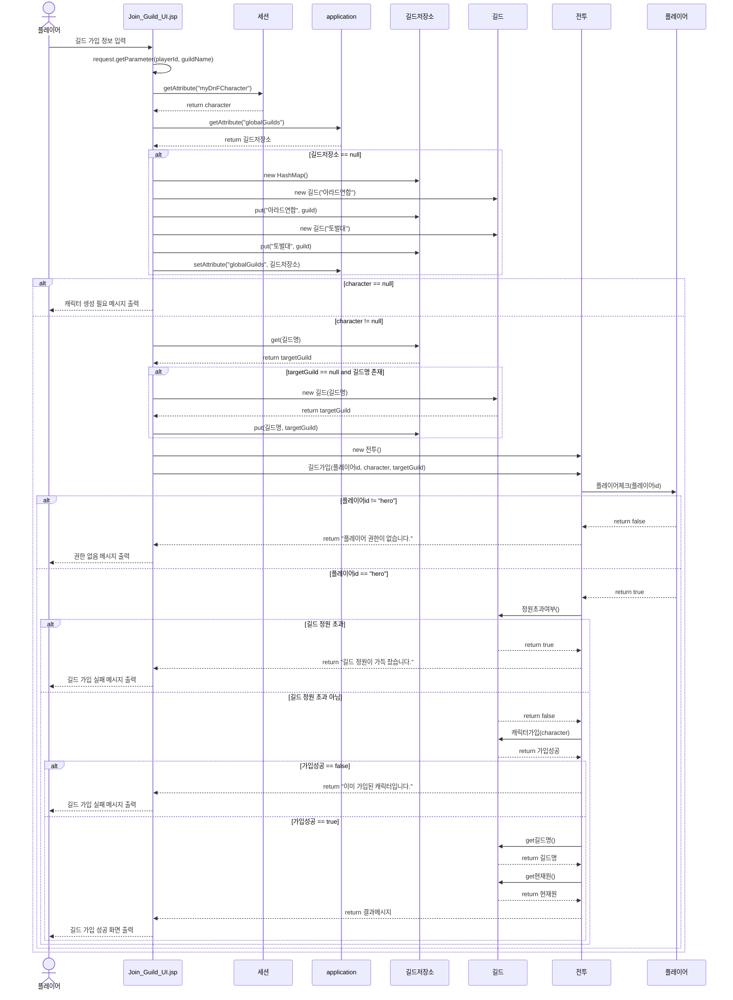

```mermaid
sequenceDiagram
    actor Player as 플레이어
    participant UI as Join_Guild_UI.jsp
    participant Session as 세션
    participant Application as application
    participant GuildMap as 길드저장소
    participant Guild as 길드
    participant Battle as 전투
    participant PlayerClass as 플레이어

    Player->>UI: 길드 가입 정보 입력
    UI->>UI: request.getParameter(playerId, guildName)

    UI->>Session: getAttribute("myDnFCharacter")
    Session-->>UI: return character

    UI->>Application: getAttribute("globalGuilds")
    Application-->>UI: return 길드저장소

    alt 길드저장소 == null
        UI->>GuildMap: new HashMap()
        UI->>Guild: new 길드("아라드연합")
        UI->>GuildMap: put("아라드연합", guild)
        UI->>Guild: new 길드("토벌대")
        UI->>GuildMap: put("토벌대", guild)
        UI->>Application: setAttribute("globalGuilds", 길드저장소)
    end

    alt character == null
        UI-->>Player: 캐릭터 생성 필요 메시지 출력

    else character != null
        UI->>GuildMap: get(길드명)
        GuildMap-->>UI: return targetGuild

        alt targetGuild == null and 길드명 존재
            UI->>Guild: new 길드(길드명)
            Guild-->>UI: return targetGuild
            UI->>GuildMap: put(길드명, targetGuild)
        end

        UI->>Battle: new 전투()
        UI->>Battle: 길드가입(플레이어id, character, targetGuild)

        Battle->>PlayerClass: 플레이어체크(플레이어id)

        alt 플레이어id != "hero"
            PlayerClass-->>Battle: return false
            Battle-->>UI: return "플레이어 권한이 없습니다."
            UI-->>Player: 권한 없음 메시지 출력

        else 플레이어id == "hero"
            PlayerClass-->>Battle: return true

            Battle->>Guild: 정원초과여부()

            alt 길드 정원 초과
                Guild-->>Battle: return true
                Battle-->>UI: return "길드 정원이 가득 찼습니다."
                UI-->>Player: 길드 가입 실패 메시지 출력

            else 길드 정원 초과 아님
                Guild-->>Battle: return false

                Battle->>Guild: 캐릭터가입(character)
                Guild-->>Battle: return 가입성공

                alt 가입성공 == false
                    Battle-->>UI: return "이미 가입된 캐릭터입니다."
                    UI-->>Player: 길드 가입 실패 메시지 출력
                else 가입성공 == true
                    Battle->>Guild: get길드명()
                    Guild-->>Battle: return 길드명

                    Battle->>Guild: get현재원()
                    Guild-->>Battle: return 현재원

                    Battle-->>UI: return 결과메시지
                    UI-->>Player: 길드 가입 성공 화면 출력
                end
            end
        end
    end
```