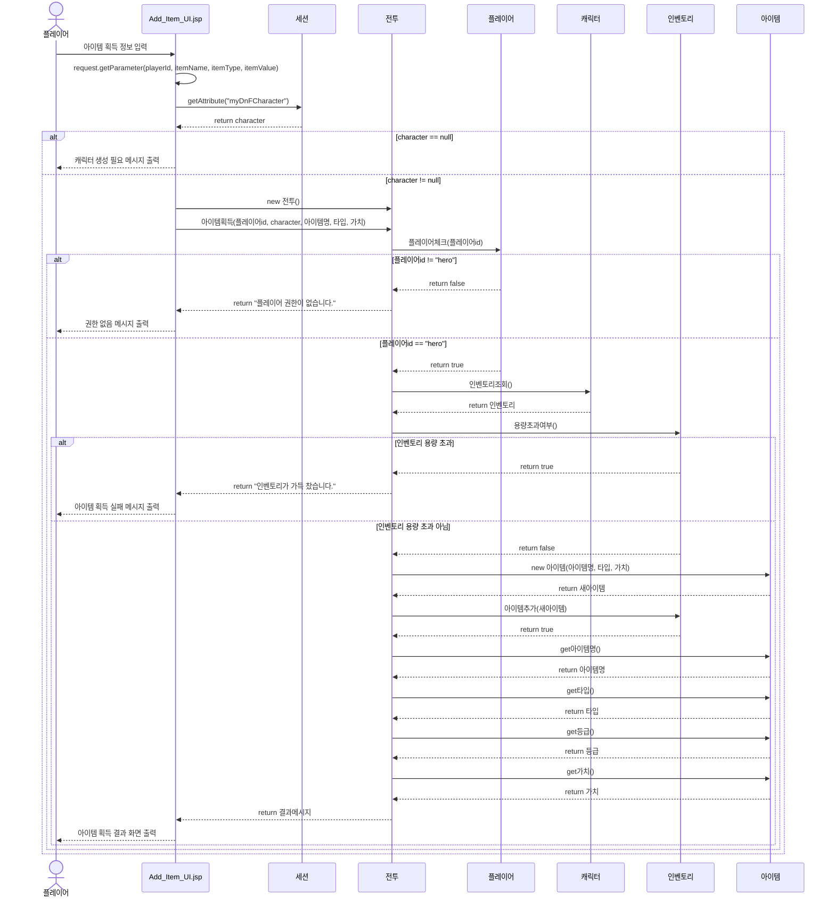

```mermaid
sequenceDiagram
    actor Player as 플레이어
    participant UI as Add_Item_UI.jsp
    participant Session as 세션
    participant Battle as 전투
    participant PlayerClass as 플레이어
    participant Char as 캐릭터
    participant Inventory as 인벤토리
    participant Item as 아이템

    Player->>UI: 아이템 획득 정보 입력
    UI->>UI: request.getParameter(playerId, itemName, itemType, itemValue)

    UI->>Session: getAttribute("myDnFCharacter")
    Session-->>UI: return character

    alt character == null
        UI-->>Player: 캐릭터 생성 필요 메시지 출력

    else character != null
        UI->>Battle: new 전투()
        UI->>Battle: 아이템획득(플레이어id, character, 아이템명, 타입, 가치)

        Battle->>PlayerClass: 플레이어체크(플레이어id)

        alt 플레이어id != "hero"
            PlayerClass-->>Battle: return false
            Battle-->>UI: return "플레이어 권한이 없습니다."
            UI-->>Player: 권한 없음 메시지 출력

        else 플레이어id == "hero"
            PlayerClass-->>Battle: return true

            Battle->>Char: 인벤토리조회()
            Char-->>Battle: return 인벤토리

            Battle->>Inventory: 용량초과여부()

            alt 인벤토리 용량 초과
                Inventory-->>Battle: return true
                Battle-->>UI: return "인벤토리가 가득 찼습니다."
                UI-->>Player: 아이템 획득 실패 메시지 출력

            else 인벤토리 용량 초과 아님
                Inventory-->>Battle: return false

                Battle->>Item: new 아이템(아이템명, 타입, 가치)
                Item-->>Battle: return 새아이템

                Battle->>Inventory: 아이템추가(새아이템)
                Inventory-->>Battle: return true

                Battle->>Item: get아이템명()
                Item-->>Battle: return 아이템명

                Battle->>Item: get타입()
                Item-->>Battle: return 타입

                Battle->>Item: get등급()
                Item-->>Battle: return 등급

                Battle->>Item: get가치()
                Item-->>Battle: return 가치

                Battle-->>UI: return 결과메시지
                UI-->>Player: 아이템 획득 결과 화면 출력
            end
        end
    end
```