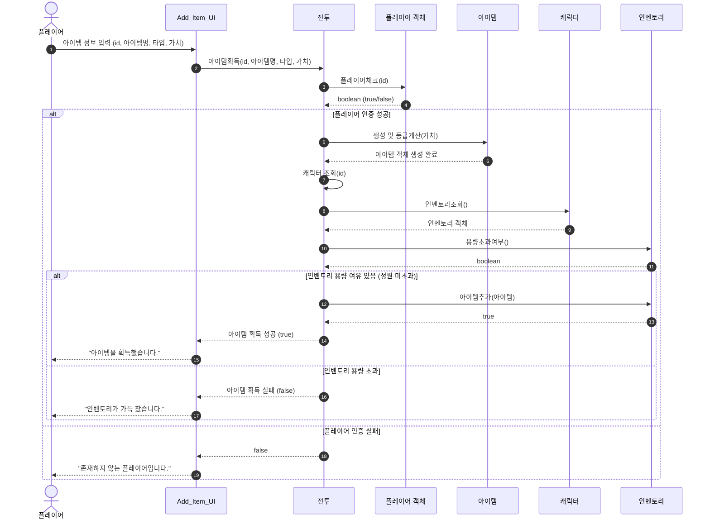

```mermaid
sequenceDiagram
    autonumber
    actor Player as 플레이어
    participant UI as Add_Item_UI
    participant Battle as 전투
    participant Pl as 플레이어 객체
    participant Item as 아이템
    participant Ch as 캐릭터
    participant Inv as 인벤토리

    Player->>UI: 아이템 정보 입력 (id, 아이템명, 타입, 가치)
    UI->>Battle: 아이템획득(id, 아이템명, 타입, 가치)
    
        Battle->>Pl: 플레이어체크(id)
        Pl-->>Battle: boolean (true/false)
    
    alt 플레이어 인증 성공
        Battle->>Item: 생성 및 등급계산(가치)
        Item-->>Battle: 아이템 객체 생성 완료
        
        Battle->>Battle: 캐릭터 조회(id)
        Battle->>Ch: 인벤토리조회()
        Ch-->>Battle: 인벤토리 객체
        
        Battle->>Inv: 용량초과여부()
        Inv-->>Battle: boolean
        
        alt 인벤토리 용량 여유 있음 (정원 미초과)
            Battle->>Inv: 아이템추가(아이템)
            Inv-->>Battle: true
            Battle-->>UI: 아이템 획득 성공 (true)
            UI-->>Player: "아이템을 획득했습니다."
        else 인벤토리 용량 초과
            Battle-->>UI: 아이템 획득 실패 (false)
            UI-->>Player: "인벤토리가 가득 찼습니다."
        end
    else 플레이어 인증 실패
        Battle-->>UI: false
        UI-->>Player: "존재하지 않는 플레이어입니다."
    end
```